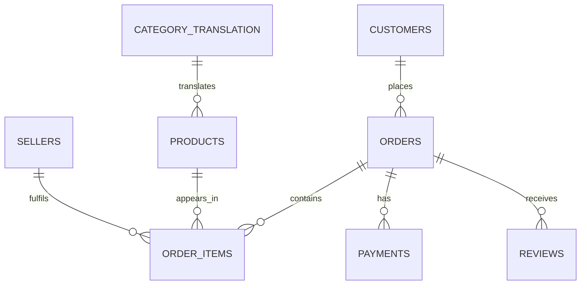

# FreshCart Order Quality Audit — MySQL

A portfolio SQL project focused on **data quality, batch-style validation, order fulfilment, reconciliation, and business reporting** using the schema of the **Brazilian E-Commerce Public Dataset by Olist**.

> **Portfolio note:** `data/sample/` contains a small synthetic, schema-compatible demo dataset so the project can be tested immediately. For the full portfolio analysis, use the original Olist CSV files from Kaggle / Olist.

## Why this project

This project demonstrates SQL work common in analyst and data-operations roles: validating batch inputs, checking anomalies, reconciling values, joining transaction tables safely, and producing reliable reporting outputs.

## Skills demonstrated

- MySQL 8.0 and relational data modelling
- Data extraction and multi-table joins
- NULL / duplicate / orphan-record validation
- Data-quality and chronology checks
- Financial reconciliation checks
- CTEs, subqueries and `CASE WHEN`
- Aggregate functions and date analysis
- Window functions: `ROW_NUMBER`, `RANK`, `NTILE`, `LAG`
- Views for reusable reporting logic
- Indexing for query performance
- KPI reporting and batch-quality scorecards

## Dataset

Full dataset: **Brazilian E-Commerce Public Dataset by Olist** — about 100,000 anonymized e-commerce orders from 2016–2018, with customers, orders, products, sellers, payments, reviews and delivery timestamps.

Sources:
- https://www.kaggle.com/datasets/olistbr/brazilian-ecommerce
- https://github.com/olist/work-at-olist-data

The full raw dataset is **not redistributed in this repository**. Download it from the source above and place the CSV files in your local data folder.

## Data model



## Important SQL design decision

`order_items`, `order_payments`, and `order_reviews` can each contain multiple rows per order. Joining all three directly would create a **many-to-many fan-out** and inflate revenue/payment values.

This project first aggregates each table to **one row per order** and only then joins the results in `vw_order_master`. This keeps KPIs accurate and is one of the most important reliability ideas in the project.

## Project structure

```text
FreshCart_Order_Quality_Audit_MySQL/
├── README.md
├── data/
│   ├── README.md
│   └── sample/                  # runnable schema-compatible demo CSVs
├── sql/
│   ├── 01_create_tables.sql
│   ├── 02_data_quality_checks.sql
│   ├── 03_add_keys_indexes.sql
│   ├── 04_clean_reporting_views.sql
│   ├── 05_business_analysis.sql
│   ├── 06_advanced_sql.sql
│   ├── 07_kpi_reporting.sql
│   ├── 08_batch_quality_scorecard.sql
│   └── ALL_QUERIES.sql
├── docs/
│   ├── DATA_DICTIONARY.md
│   ├── PROJECT_STORY.md
│   ├── RESUME_ENTRY.md
│   └── MYSQL_WORKBENCH_IMPORT_GUIDE.md
└── results/
    ├── sample_kpi_summary.csv
    ├── sample_top_categories.csv
    ├── sample_state_delivery.csv
    └── SAMPLE_FINDINGS.md
```

## How to run in MySQL Workbench

1. Open **MySQL Workbench** and connect to your local MySQL 8.0 server (for example `Local instance MySQL80`).
2. Open and run `sql/01_create_tables.sql`. This creates the `freshcart` database and its eight raw tables.
3. Import the eight CSV files into the matching tables. See `docs/MYSQL_WORKBENCH_IMPORT_GUIDE.md`.
4. Run `sql/02_data_quality_checks.sql` and review the issues.
5. Run `sql/03_add_keys_indexes.sql` only after key/orphan checks are acceptable.
6. Run `sql/04_clean_reporting_views.sql`.
7. Run `sql/05_business_analysis.sql` and `sql/06_advanced_sql.sql`.
8. Run `sql/07_kpi_reporting.sql` and `sql/08_batch_quality_scorecard.sql`.

### CSV-to-table mapping

| CSV | MySQL table |
|---|---|
| olist_customers_dataset.csv | `freshcart.customers` |
| olist_orders_dataset.csv | `freshcart.orders` |
| olist_order_items_dataset.csv | `freshcart.order_items` |
| olist_order_payments_dataset.csv | `freshcart.order_payments` |
| olist_order_reviews_dataset.csv | `freshcart.order_reviews` |
| olist_products_dataset.csv | `freshcart.products` |
| olist_sellers_dataset.csv | `freshcart.sellers` |
| product_category_name_translation.csv | `freshcart.category_translation` |

For a quick test, use the files in `data/sample/`. For the portfolio version, replace them with the original Olist files.

## Business questions answered

1. Which states have the highest cancellation / unavailability rates?
2. Which payment methods appear most often in cancelled orders?
3. How many customers make repeat purchases?
4. What is average delivery time by state?
5. Which categories are most common among repeat customers?
6. Which sellers have the highest late-delivery rates?
7. What payment value is associated with cancelled/unavailable orders?
8. Which categories generate the most item revenue?
9. How does late delivery relate to review score?
10. What are monthly payment trends and month-over-month changes?
11. Who are the highest-value customers?
12. What are the top three categories in each state?

## Reliability / validation layer

The project includes a batch-quality scorecard that checks duplicate business keys, NULL key fields, orphan records, invalid timestamp chronology, negative values, missing delivery timestamps, unmapped categories and payment/order reconciliation differences.

## Sample results

The files in `results/` are generated from the included **synthetic demo dataset only**. They demonstrate the workflow but are not presented as findings from the full Olist dataset.

## Resume-ready project title

**FreshCart Order Quality Audit | SQL, MySQL**

See `docs/RESUME_ENTRY.md` for concise resume bullets. A private interview-learning note is included locally under `private_notes/` and is ignored by GitHub Desktop through `.gitignore`.
